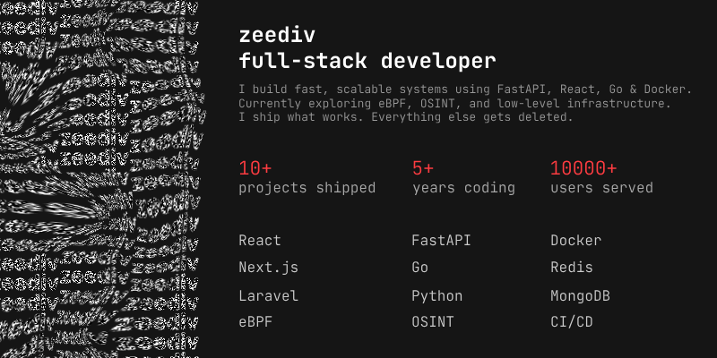

  

# Jakub

**Full-Stack Developer & Freelancer**

Building production-ready web apps, APIs, Discord bots, and self-hosted systems. Currently diving into cybersecurity, eBPF, and low-level networking.

---

## Tech Stack

**Backend:** Python (FastAPI), Go, PHP (Laravel)  
**Frontend:** Next.js, React, TailwindCSS  
**Databases:** MySQL, MongoDB, Redis  
**DevOps:** Docker, Linux, Nginx  
**Learning:** eBPF, XDP, OSINT

---

## Projects

### [Hostero.pl](https://hostero.pl)
Gaming & VPS hosting platform. Laravel backend with React frontend handling server provisioning, billing, and customer management.

### [Hoxger Tickets](https://tickets.hoxger.pl)
Support ticketing system built with FastAPI and Next.js. Keeps support teams and users connected efficiently.

### [Smithy](https://github.com/Anvoria/smithy)
Open-source project & task management tool designed for developers and freelancers. Built with FastAPI and Next.js. Emphasizes minimalism with modular architecture and GitHub integration.

### Discord Bots
5+ years building automation bots with Nextcord/Discord.py. Currently developing advanced bot for Hostero with ticket integration.

---

## Stats

  

---

## Contact

**Discord:** [zeediv](https://discord.com/users/444132380119138312)  
**Email:** jakub@hostero.pl  
**Website:** [hostero.pl](https://hostero.pl)
